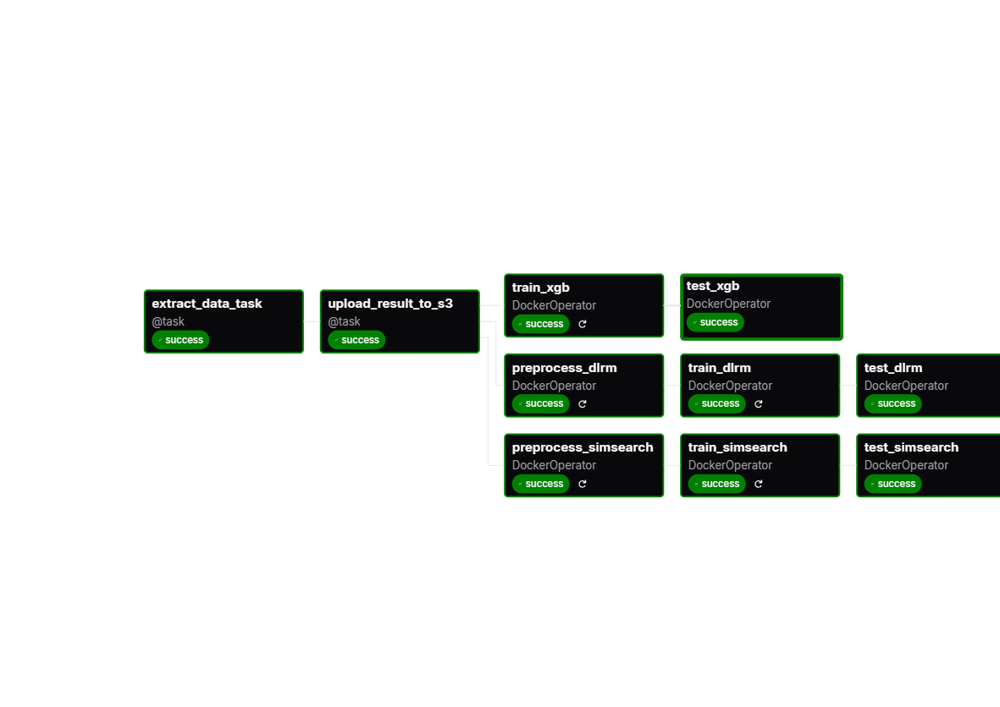

An End-to-End movie recommendation system project for education purposes.

The project is split into 3 main parts:

- A backend responsible for serving AI models using async `FastApi`.
- A simple website (frontend) using `NextJs-15`, `Prisma`, `Tailwind`.
- A Workflow using `Airflow` + `MLflow` for orchestrating AI model training and tracking.

Each project can be deployed using [Docker](https://www.docker.com/) and [Docker-compose](https://docs.docker.com/compose/) to make it as portable as possible.

### Sections:

- [Sub projects](#sub-projects)
    - [Backend](#backend)
    - [Frontend](#frontend)
    - [Worlflow Orchestration](#workflow-orchestrasion)
- [How to run](#how-to-run)

# Sub projects

## Backend

A FastApi application that serves http requests from the client for movie recommendations using ML/DL models, the application periodically checks for new models that have been trained recently and passed their tests using Mlflow for tracking the current best model.

The recommendation process is split into 2 phases:

- Sugggestion: use a similary search (KNN for example) to suggest few movies that can possibly be intersting for the user to watch. the history of the user's movie ratings is used to find similar movies.
- Prediction: Run the selected movies through the model (after getting their data like genres...) to predict the possible user's ratings for these movies.

#### Features:

- Implementation/Training scripts for ML models ([DLRM](https://github.com/facebookresearch/dlrm) and [XGBoost](https://xgboost.readthedocs.io/en/stable/)).

- The api uses a simple strategy (using a `Queue`) to batch concurrent requests to be run as a single request to reduce the need of transfering data too many times to the GPU.

- Checking for a new `best` model using [MLflow's model registery](https://mlflow.org/docs/latest/ml/model-registry/) api.

#### Stack used:

- [PyTorch](https://pytorch.org/)
- [NumPy](https://numpy.org/)
- [Pandas](https://pandas.pydata.org/)
- [Sklearn](https://scikit-learn.org/stable/)
- [XGBoost](https://xgboost.readthedocs.io/en/stable/)
- [Matplotlib](https://matplotlib.org/) &  [Seaborn](https://seaborn.pydata.org/)
- [MLflow](https://mlflow.org/)
- [FastApi](https://fastapi.tiangolo.com/)
- [Pytest](https://docs.pytest.org/en/stable/)

## Frontend

A simple web application to help demonstrate the project. The project is split into subpackages ans apps using [Turborepo](http://turborepo.com/) to help organize the codebase.

#### Features:

- App is built with [NextJs15](https://nextjs.org/) and [TailwindCss](https://tailwindcss.com/).
- All the movies/users data is stored in a [PostgreSQL](https://www.postgresql.org/) database with help of [Prisma](https://www.prisma.io/) as an [ORM](https://en.wikipedia.org/wiki/Object%E2%80%93relational_mapping).
- Backend api interface.
- Caching using Redis to reduce database reading.

#### Stack used

- [NextJs15](https://nextjs.org/)
- [TailwindCss](https://tailwindcss.com/)
- [Prisma](https://www.prisma.io/)
- [Redis](https://redis.io/)
- [Zustand](https://zustand.docs.pmnd.rs/getting-started/introduction)
- [ShadCn](https://ui.shadcn.com/)

## Workflow Orchestrasion

[Airflow](https://airflow.apache.org/) is used to orchestrate tasks such as:
- Data extraction from the database.
- Data preprocessing.
- ML model training/testing and tracking using MLflow.



#### Features:

- A `DAG` combining multiple tasks to be run in a  periodically (i.e. daily).
- Traning tasks are isolated using Airflow's `DockerOperator` to make it independant. 

# How to run

#### Seed database

```bash
docker compose db up -d  && ./filldb.sh
```

#### Build model  training docker images

```bash
cd backend && ./build_training_docker_images.sh
```
#### To run backend/frontend

```bash
docker compose up backend redis -d
cd frontend && pnpm run dev

# OR

docker compose up webapp -d
```
#### To start airflow

```bash
docker compose up airflow -d
```

#### To test backend api

```bash
cd backend
MLFLOW_TRACKING_URI=... python -m pytest -v -s
```
#### To test backend api from frontend

```bash
cd backend
MLFLOW_TRACKING_URI=... python api.py
cd ../frontend
pnpm run test:api
```